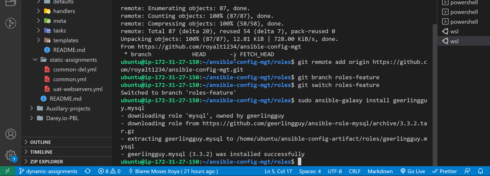
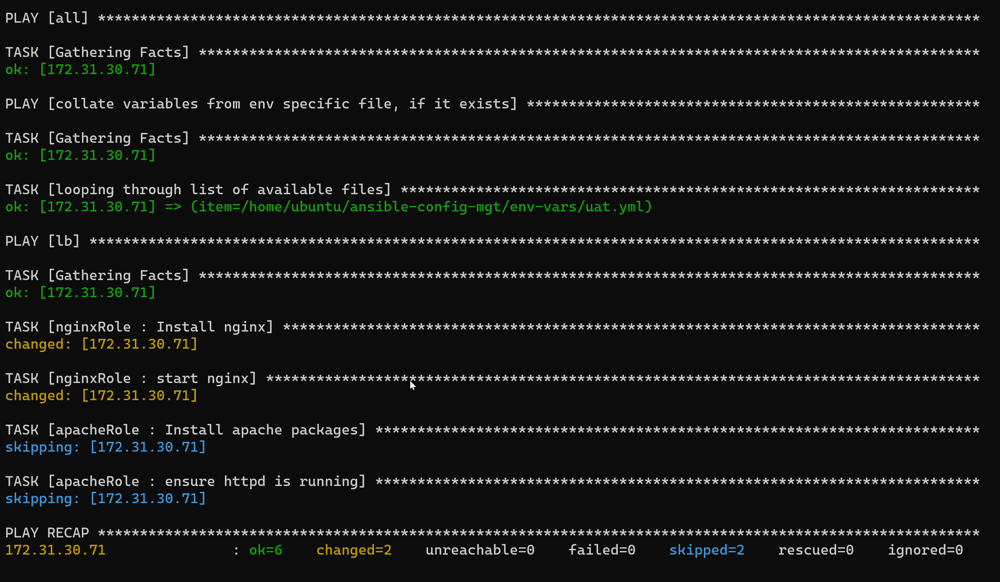
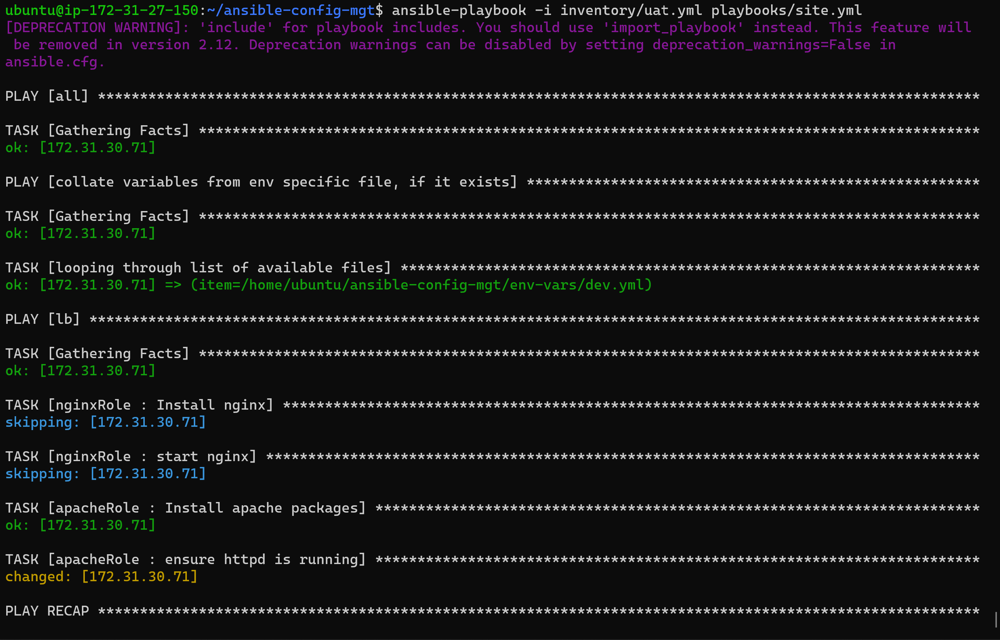

# ANSIBLE DYNAMIC ASSIGNMENTS (INCLUDE) AND COMMUNITY ROLES

In this project we will be using Ansible dynamic assignments which is an improvement over static assignments.

**what is the difference between static and dynamic assignments?**

*static assignments use `import` Ansible module. The module that enables dynamic assignments is `include`.*

When the `import` module is used, all statements are pre-processed at the time playbooks are parsed. Meaning, when you execute site.yml playbook, Ansible will process all the playbooks referenced during the time it is parsing the statements. This also means that, during actual execution, if any statement changes, such statements will not be considered. Hence, it is static.

On the other hand, when the `include` module is used, all statements are processed only during execution of the playbook. Meaning, after the statements are parsed, any changes to the statements encountered during execution will be used.


**It's advisable to use static assignments because it is more efficient and reliable. You can use dynamic assignments for environment specific variables.**


### STEP 1 - INTRODUCING DYNAMIC ASSIGNMENT INTO OUR STRUCTURE

  1. Created a new branch called **dynamic-assignments**.
  2. Created a new folder and named it **dynamic-assignments**. 
  3. Then inside this folder, created a new file called **env-vars.yml** and copy the following content into it:

  ```
  ---
  - name: collate variables from env specific file, if it exists
    hosts: all
    tasks:
      - name: looping through list of available files
        include_vars: "{{ item }}"
        with_first_found:
          - files:
              - dev.yml
              - stage.yml
              - prod.yml
              - uat.yml
            paths:
              - "{{ playbook_dir }}/../env-vars"
        tags:
          - always
 ```

**NOTE:**

1. *We used `include_vars` syntax instead of `include`, this is because Ansible developers decided to separate different features of the module. From Ansible version 2.8, the `include` module is deprecated and variants of `include_*` must be used. These are:
- include_role
- include_tasks
- include_vars
<br>
<br>
In the same version, variants of import were also introduces, such as:

- import_role
- import_tasks
<br>
<br>

2. We made use of a special variables **{ playbook_dir }** and **{ inventory_file }**. { playbook_dir } will help Ansible to determine the location of the running playbook, and from there navigate to other path on the filesystem. 

{ inventory_file } on the other hand will dynamically resolve to the name of the inventory file being used, then append .yml so that it picks up the required file within the env-vars folder.

3. We are including the variables using a loop. **with_first_found** implies that, looping through the list of files, the first one found is used. This is good so that we can always set default values in case an environment specific env file does not exist.*
PREV
ansible dynamic assignments (include) *and community roles*


### STEP 2 - UPDATE SITE.YML WITH DYNAMIC ASSIGNMENTS


1. Update site.yml file to make use of the dynamic assignment:

```
---
- hosts: all
- name: Include dynamic variables 
  tasks:
  import_playbook: ../static-assignments/common.yml 
  include: ../dynamic-assignments/env-vars.yml
  tags:
    - always

-  hosts: webservers
- name: Webserver assignment
  import_playbook: ../static-assignments/webservers.yml

```

2. Downloaded MYSQL Ansible community role from Geerlingguy on galaxy-ansible (https://galaxy.ansible.com/geerlingguy/mysql).

- Install Git, then go to ‘ansible-config-mgt’ directory and run
```
git init
git pull https://github.com/<your-name>/ansible-config-mgt.git
git remote add origin https://github.com/<your-name>/ansible-config-mgt.git
git branch roles-feature
git switch roles-feature
```

- Inside the roles directory, created new MySQL role with 
```
ansible-galaxy install geerlingguy.mysql
``` 
The folder got downloaded inside the ansible installation folder. I moved it to the project directory roles folder and renamed the folder to **mysql**.

```
sudo mv geerlingguy.mysql/ mysql
```


Now it is time to upload the changes into your GitHub:
```
git add .
git commit -m "Commit new role files into GitHub"
git push --set-upstream origin roles-feature
```

Now, if you are satisfied with your codes, you can create a Pull Request and merge it to main branch on GitHub.

### STEP 3 - LOAD BALANCER ROLES

For this case, we want to chose which web servers (loadbalancer) to use based on the deployment environment.

We have two roles:
- Nginx 
- Apache

1. Created a static-assingments/loadbalancer.yml 
2. Included the following content into it:
```
- hosts: lb
  roles:
    - { role: nginx, when: enable_nginx_lb and load_balancer_is_required }
    - { role: apache, when: enable_apache_lb and load_balancer_is_required }

```

3. Updated the site.yml file with the following:
```
- name: Loadbalancers assignment
  hosts: lb
    - import_playbook: ../static-assignments/loadbalancers.yml
  when: load_balancer_is_required
```

4. Added the following content to env-vars/uat.yml (environment variable file for UAT deployment environment):
```
enable_nginx_lb: true
load_balancer_is_required: true
```
This configuration will tell the playbook to use the Nginx role and ignore apache role when on the UAT servers



5. Added the following content to env-vars/dev.yml (environment variable file for dev deployment environment):

```
enable_apache_lb: true
load_balancer_is_required: true
```

This configuration will tell the playbook to use the Apache role and ignore nginx role when on the dev servers



6. Commited the branch to github and merged it to master which triggered the jenkins build.

7. Run the playbook.